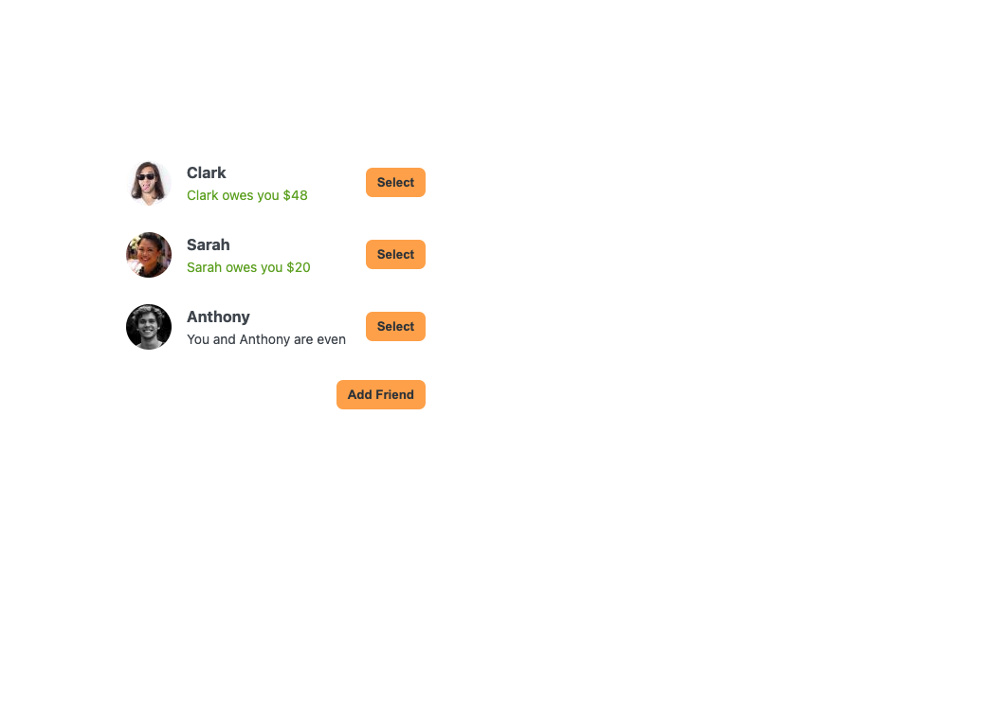
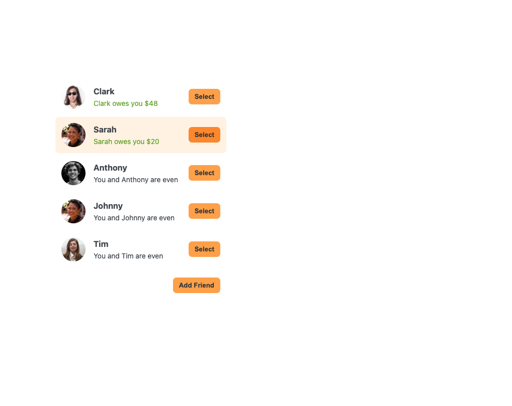
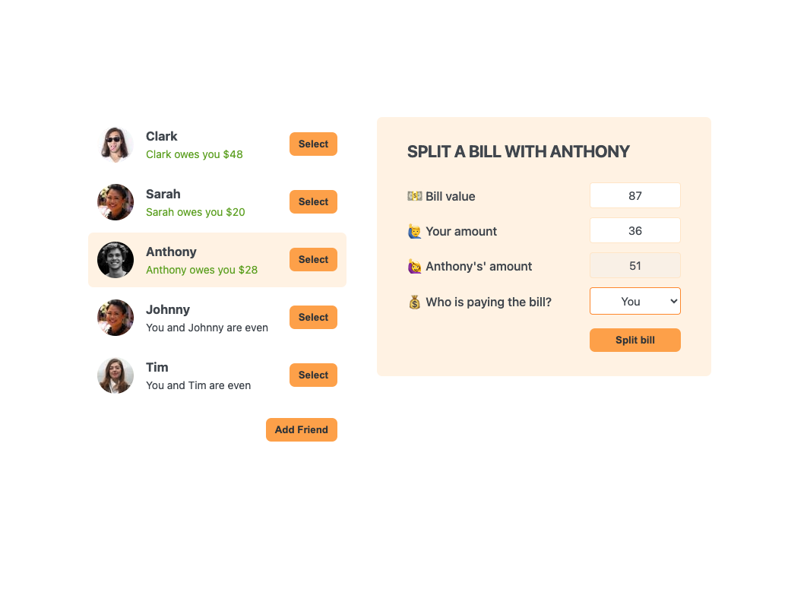
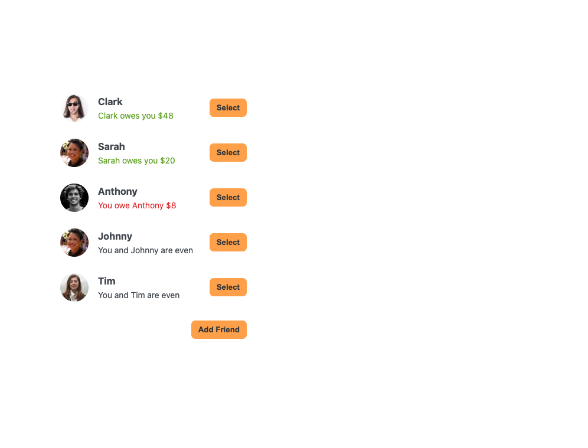

# Split the Bill

A fun, easy application that makes it easy to dine out and keep track of what you and your friends owe each other should you decide to split the bill

## Description

This application is created using React and some simple CSS styling. It allows users to add friends to a friend list with an auto generated image avatar (also allowing for an image URL if they want to add an image for a friend). Once selecting a friend they would like to split the bill with, another sidebar will open prompting users for a total bill amount, what portion of the bill is the user's amount, and who is paying the final bill. After completing the form, the friend list sidebar will be updated rendering the new amounts the user either owes or is owed by their friend.

### What I Learned

- Greater practice and implementation of state within a React application
- Continued use of props and lifting up state into components
- Simple and responsive UI for users

## Table of Contents

- [Built Using](#built-using)
- [Deployed Application](#deployed-application)
- [Installation](#installation)
- [Usage](#usage)
- [Screenshot](#screenshot)
- [Credits](#credits)
- [License](#license)
- [Questions](#questions)
- [Socials](#socials)

## Built Using

      

## Deployed Application

## Usage

## Questions

GitHub: [samocain93](https://github.com/samocain93)

## Socials

